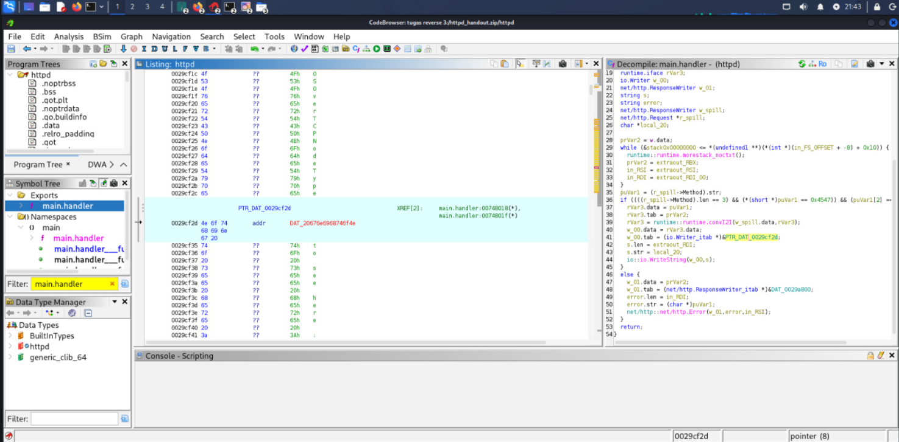
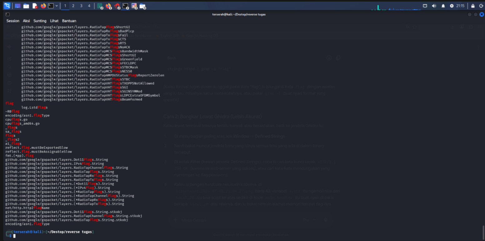

# Write-up Analisis: CrackMe-02 (Medium)

# Metadata
Nama: RE CTF 2026 - httpd
Target: mbb.exe
Tipe: C++ Console Application
Arsitektur: x86-64
Tools: Ghidra
Difficulty: 3.0 (Hard)

# Proses dalam Ghidra

# Penjelasan
## Writeup Crackme 3: RE CTF 2026 - httpd

**Deskripsi Tantangan:**
Pada tantangan ketiga ini, target analisis adalah sebuah file executable bernama `httpd`. Tujuan utamanya adalah melakukan reverse engineering untuk menemukan flag rahasia yang disembunyikan di dalam sistem web server tersebut.

**1. Analisis Dinamis (Jebakan Sistem Operasi)**
Saat mencoba mengeksekusi program secara langsung di terminal Kali Linux, muncul pesan error "Tidak ada berkas atau direktori". Setelah dianalisis menggunakan perintah `file`, diketahui bahwa binary ini dikompilasi khusus untuk sistem operasi **FreeBSD**. Karena tidak kompatibel dengan kernel Linux standar, analisis dinamis tidak dapat dilanjutkan.
![Terminal Error]

**2. Analisis Statis Menggunakan Ghidra**
Karena kendala kompatibilitas OS, program dibongkar menggunakan Ghidra. Dari penelusuran Symbol Tree, ditemukan fungsi utama program yang terletak pada `main.handler`. Logika pada fungsi ini menunjukkan bahwa program bertindak sebagai web server yang menerima HTTP GET request.
![Fungsi main.handler]

**3. Penelusuran Memori dan Penemuan Flag**
Decompiler Ghidra mengalami kesulitan dalam menerjemahkan variabel string. Melalui jendela Listing (Assembly), ditemukan sebuah instruksi pointer yang merujuk ke alamat memori `DAT_0029cf2d`. Setelah alamat tersebut dibuka, terdapat susunan byte karakter yang jika digabungkan membentuk sebuah pesan string utuh.
![Teks di Memori]

**Hasil Akhir (Flag):**
`Nothing to see here...

# Result

